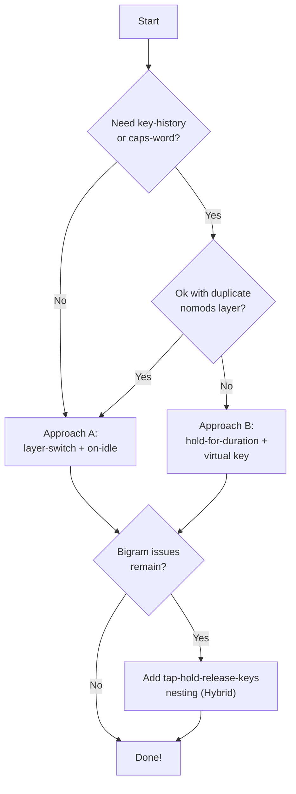

# Modern Home Row Mods in Kanata — A Practical Guide

> **Goal**: Minimize false mod activations during fast typing while keeping intentional mod use (especially multi-mod shortcuts like `Ctrl+Shift+S`) reliable and responsive.

## The Problem

Plain `tap-hold` home row mods fire modifiers when you're just typing quickly. The classic mitigations — opposite-hand key lists, `tap-hold-release-keys` — help but still break on fast bigrams, rolls, and chords.

## The Architecture: Two Layers of Defense

The modern approach uses two complementary mechanisms:

| Layer of Defense | What It Does | Kanata Feature |
|---|---|---|
| **1. Idle-gated typing mode** | Disables HRMs entirely during fast typing bursts | `layer-switch` + `on-idle` (or `hold-for-duration`) |
| **2. Positional key filtering** | For when HRMs *are* active, forces tap on same-hand rolls | `tap-hold-release-keys` nested inside `tap-hold` |

### Why Both?

- **Layer 1 alone** still allows accidental mods on the very first keypress of a fast burst (before the typing layer activates).
- **Layer 2 alone** can't prevent false activations from opposite-hand rolls and doesn't help with very fast same-hand patterns.
- **Together**: the typing layer catches 95% of fast typing, and the key filtering catches the edge cases when transitioning back to the mod layer.

---

## Approach A: `layer-switch` + `on-idle` (Recommended)

This is the reddit/urob-inspired approach. Uses a **no-mods layer** that activates instantly on any keypress and returns to base after an idle timeout.

### Core Concept

```
Key pressed → tap fires → switch to nomods layer → start idle timer
                                                        ↓
                                          idle expires → switch back to base (HRMs active)
```

### Minimal Implementation

```kanata
(defcfg
  process-unmapped-keys yes
  concurrent-tap-hold yes
)

(defvar
  ;; ── Timing Variables ──────────────────────────────────
  tap-time          200   ;; tap-repress-timeout (quick-tap in ZMK)
  hold-time         280   ;; tapping-term
  require-prior-idle 150  ;; ms of idle before HRMs re-engage

  ;; ── Positional Key Lists (for nested tap-hold-release-keys) ──
  ;; Keys on the left side that should force same-hand HRMs to tap
  keys-l (q w e r t)
  ;; Keys on the right side that should force same-hand HRMs to tap
  keys-r (u i o p)
)

(defvirtualkeys
  to-base (layer-switch base)
)

;; ── The Tap Alias ───────────────────────────────────────
;; Every HRM tap action fires this via (multi $key @tap).
;; It switches to nomods and schedules a return via on-idle.
(defalias
  tap (multi
    (layer-switch nomods)
    (on-idle $require-prior-idle tap-virtualkey to-base)
  )
)
```

### HRM Templates

Use `tap-hold-release-keys` to add positional filtering for same-hand bigram protection:

```kanata
;; ── Left-hand HRM template ─────────────────────────────
(deftemplate lhrm (tap-key hold-key)
  (tap-hold-release-keys
    $tap-time $hold-time
    (multi $tap-key @tap)    ;; tap: output key + enter typing mode
    $hold-key                ;; hold: modifier
    $keys-l                  ;; same-hand keys → force tap early
  )
)

;; ── Right-hand HRM template ────────────────────────────
(deftemplate rhrm (tap-key hold-key)
  (tap-hold-release-keys
    $tap-time $hold-time
    (multi $tap-key @tap)
    $hold-key
    $keys-r
  )
)
```

### Define Your HRMs

```kanata
(defalias
  ;; Left hand                    key    modifier
  my-a (t! lhrm                   a      lmet)
  my-r (t! lhrm                   r      lalt)
  my-s (t! lhrm                   s      lctl)
  my-t (t! lhrm                   t      lsft)

  ;; Right hand
  my-n (t! rhrm                   n      rsft)
  my-e (t! rhrm                   e      rctl)
  my-i (t! rhrm                   i      ralt)
  my-o (t! rhrm                   o      rmet)
)
```

### Layer Definitions

```kanata
(deflayer base
  ;;  ...your layout with @my-a @my-r @my-s @my-t etc...
  @my-a @my-r @my-s @my-t  g     m  @my-n @my-e @my-i @my-o
)

(deflayer nomods
  ;;  Same layout but NO home row mods — plain keys
  ;;  EXCEPTION: keep shift HRMs here for CamelCase while fast-typing
  a     r     s     t     g     m     n     e     i     o
)
```

### Non-HRM Keys as Typing-Layer Triggers

Every letter key should also trigger the typing layer so it activates on *any* fast typing, not just HRM key presses:

```kanata
;; Option 1: Wrap in (multi key @tap) in deflayer/deflayermap
;; Option 2: Use deflayermap to map each letter key
(deflayermap (base)
  q (multi q @tap)
  w (multi w @tap)
  ;; ... etc for all letter keys
)
```

> [!TIP]
> On the nomods layer, keys are just plain letters — no `@tap` needed since you're already in typing mode. The `on-idle` timer handles returning to base.

---

## Approach B: `hold-for-duration` + Virtual Key (No Extra Layer)

This is gerhard-h's latest approach. Instead of a separate layer, it uses a virtual key as a flag that's checked by each HRM via `switch`.

### Core Concept

```
Key pressed → hold-for-duration sets fasttypingstate for ~55ms
                    ↓
HRM's switch checks: is fasttypingstate active?
  → YES: output plain key (no tap-hold at all)
  → NO:  use normal tap-hold
```

### Implementation

```kanata
(defvirtualkeys
  fasttypingstate XX  ;; a virtual key used purely as state flag
)

(deftemplate type (action)
  (multi
    (fork
      (hold-for-duration 55 fasttypingstate)  ;; set flag for 55ms
      XX
      (lctl rctl lalt ralt lmet rmet)  ;; don't set flag if mods are held
    )
    $action
  )
)

(deftemplate homerowmod (timeouttap timeouthold keytap keyhold)
  (switch
    ;; If typing fast → just output the key, skip tap-hold entirely
    ((input virtual fasttypingstate)) (t! type $keytap) break
    ;; Otherwise → normal tap-hold
    () (tap-hold $timeouttap $timeouthold
         (t! type $keytap)
         $keyhold
       ) break
  )
)
```

### Tradeoffs vs Approach A

| Aspect | Approach A (`layer-switch`) | Approach B (`hold-for-duration`) |
|---|---|---|
| **Complexity** | Requires a duplicate nomods layer | No extra layer needed |
| **Key-history** | Clean (no nop pollution) | Clean with XX virtual key trick |
| **Caps-word** | Needs careful handling | Works out of the box |
| **Bigram filtering** | Easy with `tap-hold-release-keys` | Harder — `tap-hold-release-keys` has interaction issues with `hold-for-duration` |
| **CamelCase** | Keep shift on nomods layer | Works naturally |
| **Idle detection** | Explicit `on-idle` timer | Implicit via `hold-for-duration` expiry |

---

## Hybrid: Nesting `tap-hold-release-keys` Inside `tap-hold`

> [!IMPORTANT]
> This is the approach the user specifically asked about. It combines the best of both worlds.

The idea: use plain `tap-hold` as the outer wrapper (for typing-layer triggering), then nest `tap-hold-release-keys` inside it for positional filtering. This works around the known interaction issues between `tap-hold-release-keys` and `hold-for-duration` / virtual key state.

```kanata
(deftemplate hrm-hybrid (timeouttap timeouthold keytap keyhold sameside-keys)
  (switch
    ((input virtual fasttypingstate)) (t! type $keytap) break
    () (tap-hold-release-keys $timeouttap $timeouthold
         (t! type $keytap)
         $keyhold
         $sameside-keys
       ) break
  )
)
```

> [!WARNING]
> With `concurrent-tap-hold yes`, nesting tap-hold variants is possible but adds complexity. Test thoroughly. If interaction bugs appear, fall back to plain `tap-hold` inside the switch (Approach B pure) and rely on the typing-layer suppression alone.

---

## Timing Recommendations

| Parameter | Value | Notes |
|---|---|---|
| `tap-time` (quick-tap) | 150–200ms | Higher = more forgiving double-taps |
| `hold-time` (tapping-term) | 250–300ms | Higher = fewer false mods but slower intentional activation |
| `require-prior-idle` | 100–250ms | Lower = HRMs re-engage sooner after typing stops |
| `hold-for-duration` timeout | 40–80ms | Only for Approach B. Short values (55ms) work best paradoxically |

### Per-Finger Timing (Advanced)

Not all fingers are equally fast. Consider higher hold timeouts for slower/less-used mods:

| Modifier | Suggested Hold Timeout |
|---|---|
| Shift (index) | 150–180ms |
| Ctrl (middle) | 250–300ms |
| Alt (ring) | 300–400ms |
| Meta/Super (pinky) | 350–450ms |

---

## Multi-Mod Shortcuts

Multi-mod shortcuts (e.g., `Ctrl+Shift+S`) are the hardest test for HRMs. Here's what matters:

### Order of Operations
1. Press and **hold** first mod key (e.g., `Ctrl/s`) — wait for hold to activate
2. Press and **hold** second mod key (e.g., `Shift/t`) — wait for hold to activate
3. Tap the target key (e.g., `a`)

### Why `tap-hold-release-keys` Matters Here
With plain `tap-hold`, pressing a second home-row mod *on the same hand* while the first is still pending could trigger a false tap. `tap-hold-release-keys` with positional filtering prevents this by only counting opposite-hand key-releases as hold triggers — same-hand keys resolve to tap. 

### The `tap-hold-release-tap-keys-release` Variant
For maximum ZMK compatibility (balanced flavor + `hold-trigger-on-release`), use this variant:

```kanata
(deftemplate lhrm-full (tap-key hold-key)
  (tap-hold-release-tap-keys-release
    $tap-time $hold-time
    (multi $tap-key @tap)
    $hold-key
    $keys-l                   ;; same-hand keys → force tap on press
    (a s d f g)               ;; home row keys → force tap on press+release
  )
)
```

The second key list (`$tap-trigger-keys-on-press-then-release`) handles same-hand home row keys — they force tap only after being pressed *and* released, allowing intentional multi-mod combos where you hold both keys.

---

## Choosing Your Approach



---

## Quick Reference: What Each Piece Does

| Kanata Feature | ZMK Equivalent | Role in HRMs |
|---|---|---|
| `layer-switch nomods` | — | Instantly disables HRMs |
| `on-idle N tap-virtualkey to-base` | `require-prior-idle-ms` | Re-enables HRMs after N ms idle |
| `tap-hold-release-keys` | `hold-trigger-key-positions` | Same-hand keys force tap |
| `tap-hold-release-tap-keys-release` | `hold-trigger-key-positions` + `hold-trigger-on-release` | Full urob compatibility |
| `hold-for-duration N fasttypingstate` | — | Approach B: time-based fast-typing flag |
| `(input virtual fasttypingstate)` | — | Approach B: check if typing fast |
| `tap-hold-tap-keys` | — | Like `tap-hold-release-keys` but *never* activates hold early |
| `concurrent-tap-hold yes` | — | Required for nesting tap-hold variants |
